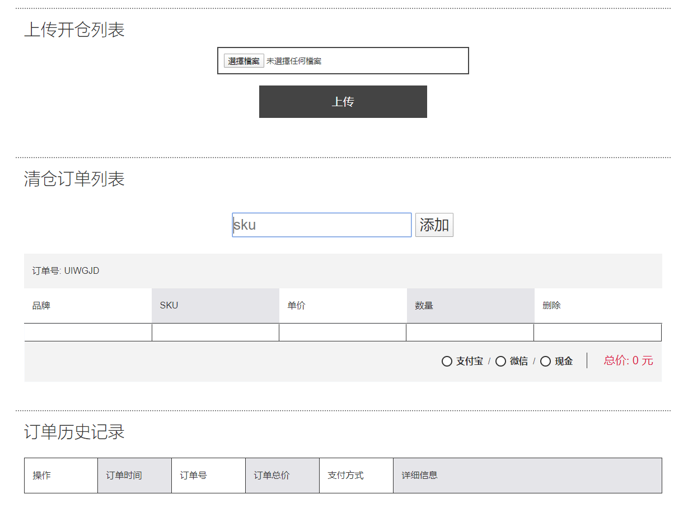
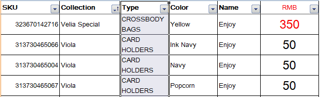
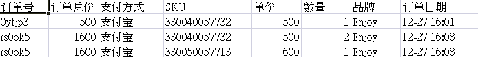

# Angularjs-SimplifiedOrderSystem for factory clearance

### Screenshots
- Page

- Input Excel

- Output Excel

### Features
  <ul>
      <li>Angular.js 1.x</li>
      <li>IndexedDB for local database</li>
      <li>Upload a local excel file of produce information</li>
      <li>Generate excel files of each day order list</li>
      <li>Only use 3-4 days, there is no need to build whole system and add real backend</li>
      <li>Running at Chrome and didn't fix display issues with compatibility view in other browsers</li>
  </ul>
